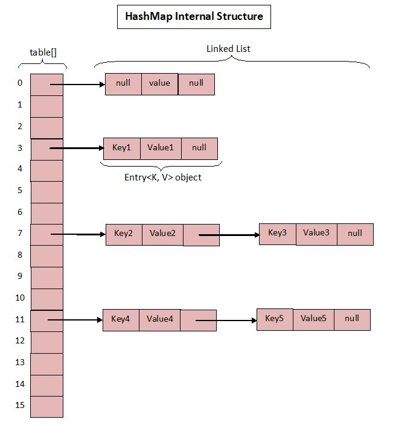

# java 基础总结  （面试必问）
## HashMap
众所周知 HashMap 底层是基于 数组 + 链表 组成的，不过在 jdk1.7 和 1.8 中具体实现稍有不同。

 **Base 1.7**

- 1.7 中的数据结构图：


先来看看 1.7 中的实现:

1. 初始化桶大小16，因为底层是数组，所以这是数组默认的大小。
2. 桶最大值 2的30次幂 。
3. 默认的负载因子（0.75）
4. table 真正存放数据的数组。
5. Map 存放数量的大小。
6. 桶大小，可在初始化时显式指定。
7. 负载因子，可在初始化时显式指定。

```java
        public HashMap() {
            this(DEFAULT_INITIAL_CAPACITY, DEFAULT_LOAD_FACTOR);
        }
    
        public HashMap(int initialCapacity, float loadFactor) {
            if (initialCapacity < 0)
                throw new IllegalArgumentException("Illegal initial capacity: " +
                                                   initialCapacity);
            if (initialCapacity > MAXIMUM_CAPACITY)
                initialCapacity = MAXIMUM_CAPACITY;
            if (loadFactor <= 0 || Float.isNaN(loadFactor))
                throw new IllegalArgumentException("Illegal load factor: " +
                                                   loadFactor);
    
            this.loadFactor = loadFactor;
            threshold = initialCapacity;
            init();
        }
```

